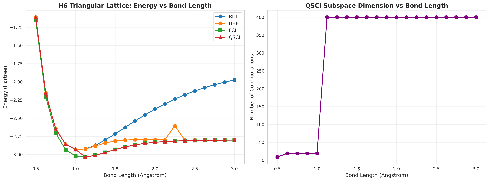

02_h6_lattice — H6 triangular lattice

Purpose
- Compare RHF, UHF, FCI, and QSCI energies on an H6 triangular lattice across bond lengths.
- Track QSCI subspace dimension as a function of geometry.

<figure>
  
  <figcaption>
    Two-panel summary: (left) energy comparison across RHF, UHF, FCI, and QSCI vs bond length; (right) growth of the QSCI-selected subspace with increasing bond length.
  </figcaption>
</figure>

Main script
- 02_h6_lattice.py — scans bond lengths, computes energies, and records QSCI subspace size.

Outputs
- Figure: figures/h6_lattice_energies.png
- Console logs of energies and QSCI subspace size per bond length.
