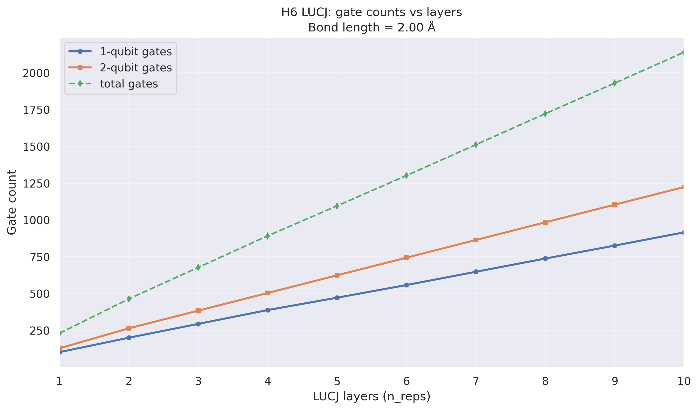

LUCJ circuits and comparisons (09)

Purpose
- Explore Low-Depth Unitary Coupled-Cluster with Jastrow (LUCJ) circuits and compare with alternatives.

<figure>
  
  <figcaption>
    Energy convergence at 2.00 Å comparing LUCJ variants/parameters; highlights how low-depth ansätze approach reference energies under QSCI evaluation.
  </figcaption>
</figure>

<figure>
  
  <figcaption>
    09c: Absolute energy error to FCI (log scale) for LUCJ circuits with layers 1–10 plotted against subspace size (spin‑symmetric QSCI). Layers are colored with a plasma colormap. The black squares show the FCI subspace absolute error curve, and the orange diamonds (dashed) show the greedy subspace selection error. The diagonally striped green/grey band marks the “chemical accuracy” region (≤ 1.6×10⁻³ Ha). Y‑axis is lower‑bounded at 1×10⁻⁵ Ha; x‑axis bounds follow the data.
  </figcaption>
  
</figure>

<figure>
  
  <figcaption>
    09c: Number of single‑qubit, two‑qubit, and total gates versus the number of LUCJ layers (n_reps) after transpilation to a standard basis. Useful for assessing scaling of circuit complexity with depth.
  </figcaption>
</figure>

Scripts
- 09a_lucj_circuit.py — construct and analyze a LUCJ circuit across bond lengths
- 09b_lucj_comparison.py — compare LUCJ variants/parameters
- 09c_lucj_layers.py — study LUCJ layer counts (1–10): CSV‑first workflow with plots of error vs subspace size (including FCI and greedy overlays) and gate counts vs layers

Outputs
- Saved under data/09a, data/09b, and data/09c_lucj_layers respectively, with per‑run subfolders (e.g., bond_length_2.00)

Usage
- From repository root:
  - python research/09_lucj/09a_lucj_circuit.py
  - python research/09_lucj/09b_lucj_comparison.py
  - python research/09_lucj/09c_lucj_layers.py