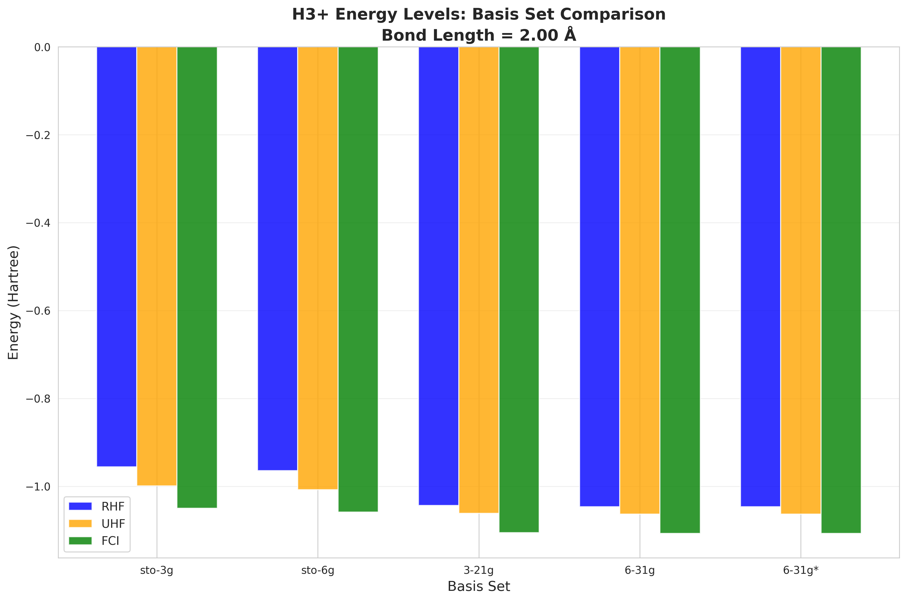
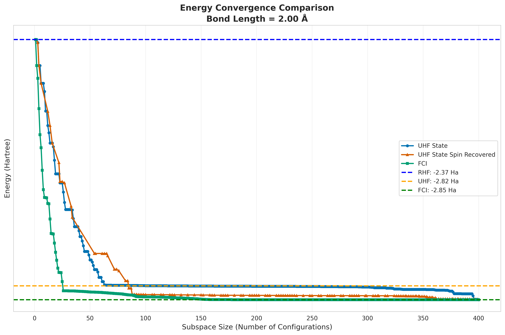
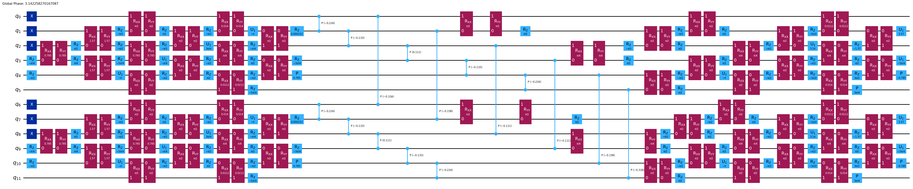
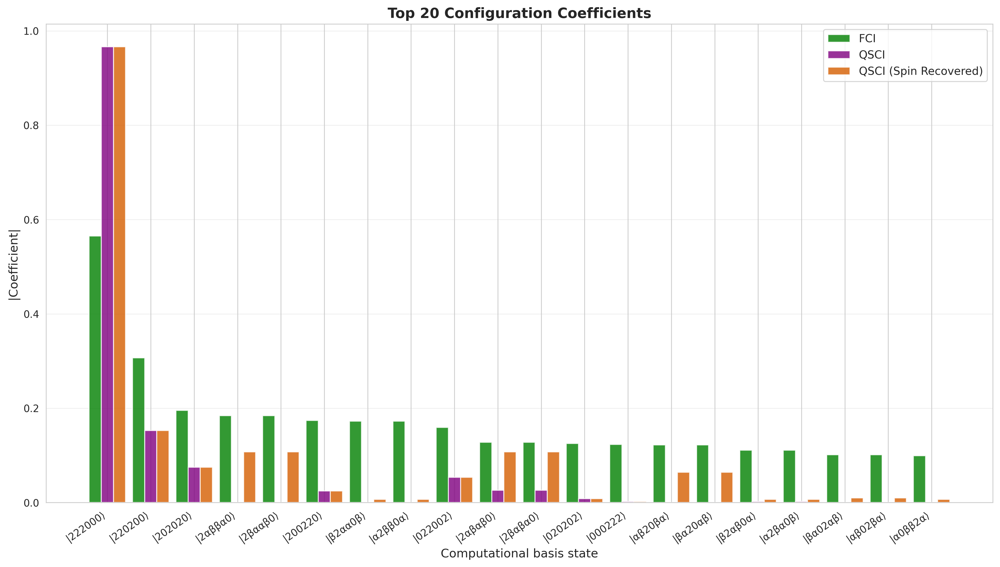
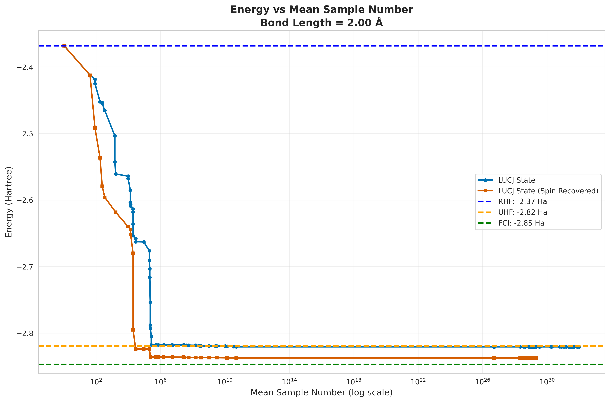
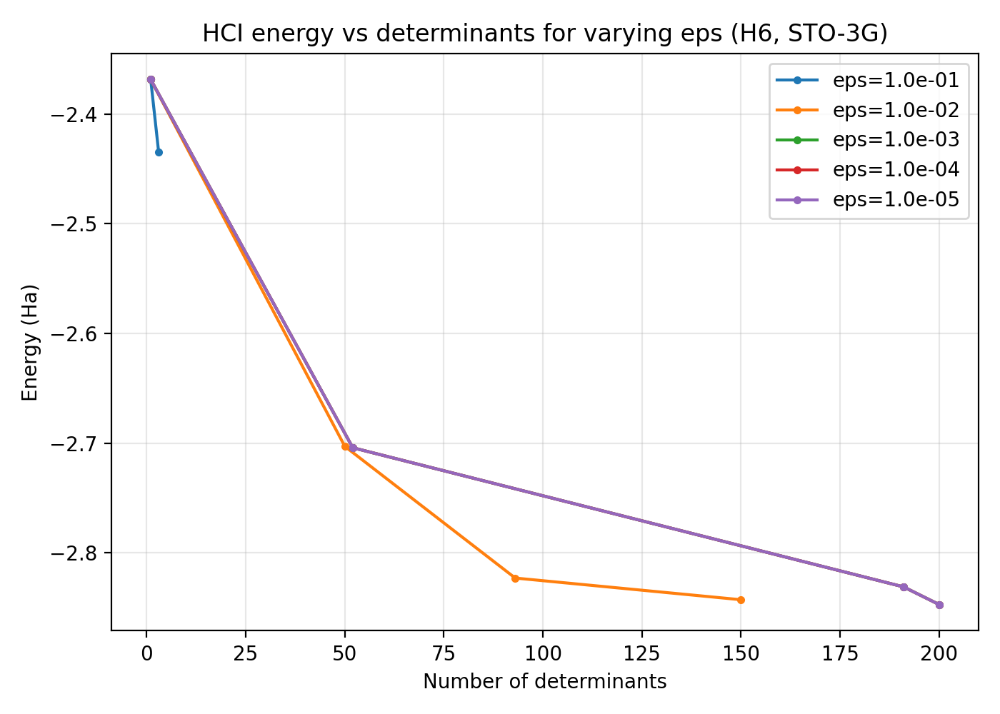
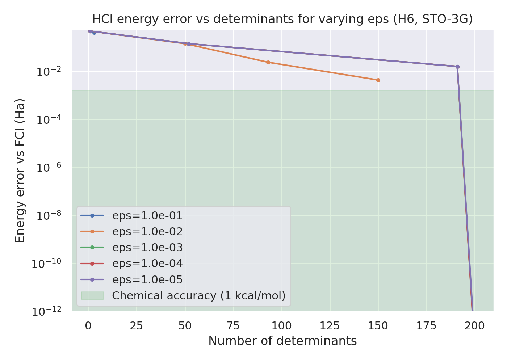

Research overview

This directory contains numbered research studies. Each group folder collects related scripts and their data outputs. See each group's README for details and usage.

Overall story
- 01_h4_chain lays the foundation: we validate the RHF→UHF orbital-rotation circuit and compare RHF/UHF/FCI/QSCI across bond lengths for H4.
- 02_h6_lattice scales up to H6 in a triangular lattice, tracking both energies and the size of the QSCI-selected subspace as correlation grows.
- 03_h6_lattice_dev explores methodology details on H6: how sampling/weighting affects QSCI convergence and how chain geometry behaves vs samples.
- 04_aws_start establishes access to AWS Braket devices and a tiny GHZ trial (no figures; console/device listings).
- 05_h3_basis_sets provides a baseline H3+ STO‑3G convergence reference used to calibrate expectations.
- 06_h3_basis_comparison broadens the H3+ study across many basis sets to map accuracy–cost trade‑offs.
- 07_h6_chain_bisect tunes H6 chain parameters by bisection, examining convergence stability.
- 08_spin_recovery restores spin symmetry and shows its effect on QSCI convergence.
- 09_lucj evaluates low‑depth UCC‑Jastrow (LUCJ) circuits and compares variants at fixed geometries.

At‑a‑glance results
<figure>
  
  <figcaption>
    01 H4 chain: RHF, UHF, FCI, and QSCI vs bond length. QSCI tracks FCI near equilibrium; UHF lowers energy as symmetry breaks.
  </figcaption>
  </figure>

<figure>
  
  <figcaption>
    02 H6 triangular lattice: left — energy comparison (RHF/UHF/FCI/QSCI); right — growth of the QSCI subspace with increasing bond length.
  </figcaption>
</figure>

<figure>
  
  <figcaption>
    03b H6 lattice weighting: reweighting strategies accelerate QSCI convergence.
  </figcaption>
</figure>

<figure>
  
  <figcaption>
    03c H6 chain: energy error decreases with more sampled configurations, illustrating the sample‑efficiency trade‑off.
  </figcaption>
</figure>

<figure>
  
  <figcaption>
    05a H3+ STO‑3G: baseline convergence at 2.00 Å used as a reference when contrasting minimal bases.
  </figcaption>
</figure>

<figure>
  
  <figcaption>
    06 H3+ basis comparison: energy levels overview mapping accuracy–cost trends across bases.
  </figcaption>
</figure>

<figure>
  
  <figcaption>
    07 H6 chain (bisection): convergence stabilizes around the target as parameters are tuned.
  </figcaption>
</figure>

<figure>
  
  <figcaption>
    08 Spin recovery: enforcing spin symmetry improves convergence relative to the unconstrained reference at 2.00 Å.
  </figcaption>
</figure>

<figure>
  
  <figcaption>
    09 LUCJ comparison: low‑depth ansätze approach reference energies under QSCI evaluation at fixed geometry.
  </figcaption>
</figure>

<figure>
  
  <figcaption>
    09a LUCJ circuit: example transpiled circuit structure at 2.00 Å (showing alternating orbital‑rotation and Jastrow‑style entangling layers).
  </figcaption>
</figure>

<figure>
  
  <figcaption>
    09a LUCJ amplitudes: leading statevector coefficients after preparing the LUCJ state at 2.00 Å (spin‑symmetric sector).
  </figcaption>
</figure>

<figure>
  
  <figcaption>
    09a H6 with LUCJ: energy convergence versus sampled configurations in QSCI at fixed geometry (2.00 Å).
  </figcaption>
</figure>

<figure>
  
  <figcaption>
    12c HCI sweep: energy versus determinant count for several selection thresholds (ε). Lower ε includes more determinants and approaches the reference.
  </figcaption>
</figure>

<figure>
  
  <figcaption>
    12c HCI sweep: absolute energy error (log scale) as a function of determinant count for varying ε, illustrating accuracy–cost trade‑offs.
  </figcaption>
</figure>

Groups
- 00_profile — Line profiling for the RHF→UHF workflow and related utilities. See 00_profile/README.md
- 01_h4_chain — H4 chain energies (RHF/UHF/FCI/QSCI) and validation of orbital-rotation circuit. See 01_h4_chain/README.md
- 02_h6_lattice — H6 triangular lattice energies and QSCI subspace sizing. See 02_h6_lattice/README.md
- 03_h6_lattice_dev — H6 lattice/chain experiments (config counts, weighting, chain). See 03_h6_lattice_dev/README.md
- 04_aws_start — AWS Braket device discovery and trial scripts. See 04_aws_start/README.md
- 05_h3_basis_sets — H3+ with various minimal basis sets (STO-3G/6G) and small comparisons. See 05_h3_basis_sets/README.md
- 06_h3_basis_comparison — Broad basis set comparison for H3+. See 06_h3_basis_comparison/README.md
- 07_h6_chain_bisect — Bisection search for H6 chain parameters. See 07_h6_chain_bisect/README.md
- 08_spin_recovery — Spin-symmetry recovery experiments. See 08_spin_recovery/README.md
- 09_lucj — LUCJ circuit experiments and comparisons. See 09_lucj/README.md

Conventions
- Data are saved per script under data/<short_code>/..., where <short_code> is the script prefix (e.g., 05a, 06, 09b).
- Figures generated by studies are stored under figures/ (see figures/README.md).